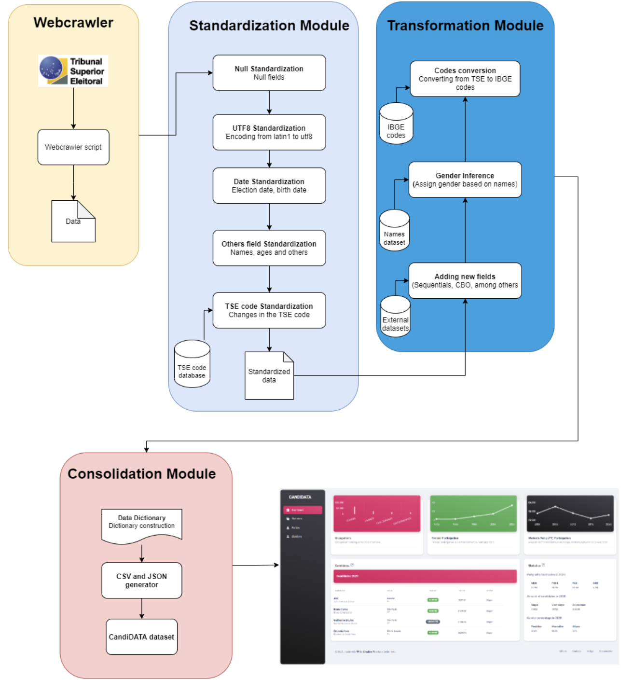
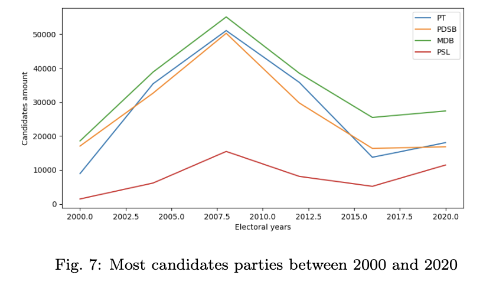
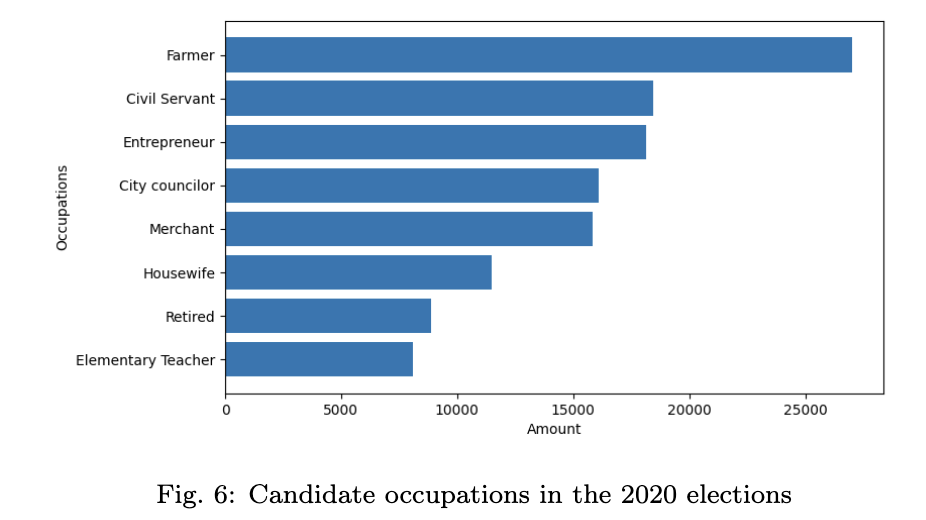
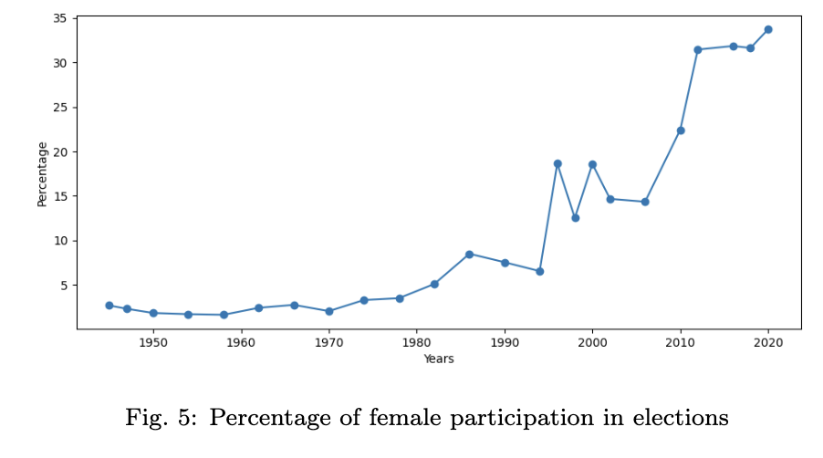

# CandiDATA dataset

This repo is related to the code used for creating the CandiDATA dataset, which was published both at the Brazilian Symposium of Databases (SBBD) and in the Journal of Information and Data Management (JIDM), as an extended version. The paper is available at https://doi.org/10.5753/jidm.2022.2361

### Problems found on the original dataset

We used the data from the Superior Electoral Court (TSE) from Brazil, regarding elections from 1933 to 2020.

Here’s your text rewritten as clear bullet points:

* Analyzing data from the TSE portal is challenging due to:

  * Inconsistencies in data and documentation
  * Lack of known standards and formats

**Main problems identified and addressed during the construction of CadiDATA:**

* **File format inconsistencies**:

  * Data files until 2010 are in TXT format without headers
  * From 2012 onwards, files are in CSV format with headers

* **Inconsistent field descriptions in data dictionaries**:

  * Same attribute has different names
  * Lack of standardization across dictionaries within the same category
  * *Critical case*: Accountability data has a different dictionary for each election year; 2014 has no dictionary at all

* **Encoding issues**:

  * Data content is in **latin1**, which may cause errors when loading due to lack of international encoding standard

* **Date field standardization failures**:

  * Multiple formats used, such as `dd/MM/yyyy`, `ddMMyy`, and `dd/MM/yy`

* **Municipal code inconsistencies**:

  * Does not follow the IBGE (Brazilian Institute of Geography and Statistics) standard for city identification

* **Voter ID inconsistencies**:

  * Standard is 12 digits, but some records use older formats with fewer digits

* **Missing candidate gender field**:

  * No gender data for candidates from 1945 to 1994

* **Attribute naming inconsistencies**:

  * Attribute names vary across election years

* **Multiple representations for null values**:

  * Nulls appear as `#NULO#` and `#NE#` in string format

### Our proposal

The following figure depicts our proposed solution to fix these issues and to provide clean data for users.

### Data analysis

Some analysis that users are able to do using our datasets are:

